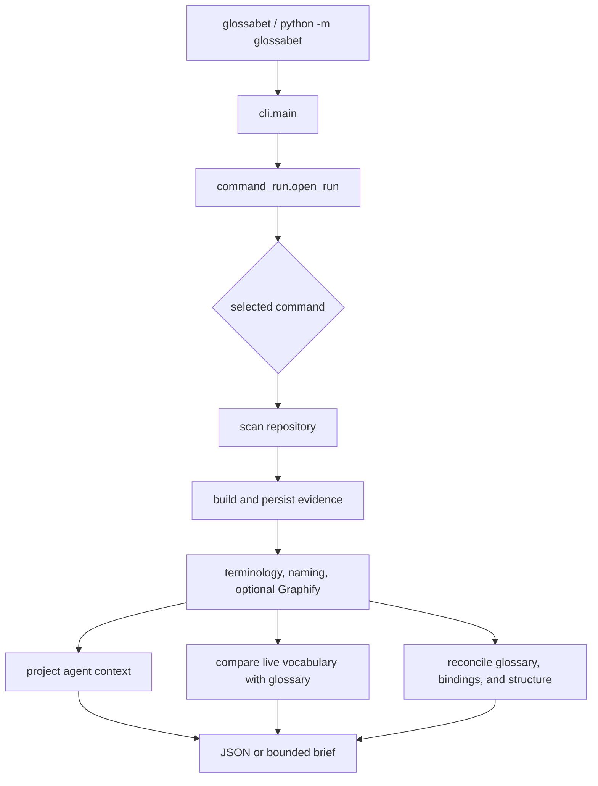

# Architecture

Glossabet is a deterministic, standard-library Python engine paired with an
agent skill. The engine extracts bounded evidence and enforces persisted-data
contracts. The skill uses that evidence to reason about names. The product
boundary is deliberate: the agent may propose and discuss vocabulary, but the
human decides what becomes canonical.

This document describes the current source tree. For user behavior, see
[`docs/WALKTHROUGH.md`](docs/WALKTHROUGH.md). For an implementation trace and
safe extension guide, see
[`docs/CODE-WALKTHROUGH.md`](docs/CODE-WALKTHROUGH.md).

## Repository authority map

The repository contains product source, executable assurance, retained
evidence, generated release payloads, and construction history. Their
proximity does not make them interchangeable owners.

| Surface | Canonical responsibility | Copies, generated state, and lifecycle |
| --- | --- | --- |
| [`glossabet/`](glossabet/) | Shipped engine, CLI, schemas, and installers. A product behavior is owned here, not by a test or evaluator that observes it. | The wheel packages this tree plus the canonical skill. [`corpus/unicode_marks.py`](glossabet/corpus/unicode_marks.py) is a checked-in generated table whose explicit producer is [`scripts/gen_unicode_marks.py`](scripts/gen_unicode_marks.py). |
| [`tests/`](tests/) | Executable contracts, regressions, platform cases, and release-policy mutation checks. | Tests describe required behavior but do not become alternate product implementations or empirical results. They ship only in the source distribution. |
| [`EVALUATION.md`](EVALUATION.md) and [`evaluation/`](evaluation/) | `EVALUATION.md` owns public methodology, retained measurements, and claim limits. [`evaluation/README.md`](evaluation/README.md) maps maintained scenarios/schemas, lane code, selected baselines, immutable raw runs, and archives to their producers. | Producer-owned JSON evidence is checked in for reproducibility and is never hand-edited. Evaluation code/evidence ships in the source distribution, not the application wheel. |
| [`scripts/`](scripts/) | Maintainer entry points for evaluation wrappers, release checks, plugin assembly/smoke, benchmarks, walkthroughs, and deliberate data generation. | A script is authoritative for the operation it performs; generated output remains owned by the named destination and its verifier. Scripts ship only in the source distribution. |
| [`skill/SKILL.md`](skill/SKILL.md) | The one canonical agent workflow and behavioral instruction source. | The wheel copy and [`plugins/glossabet/skills/glossabet/SKILL.md`](plugins/glossabet/skills/glossabet/SKILL.md) are generated/verified copies, never independent specifications. |
| [`plugins/glossabet/`](plugins/glossabet/) | Checked-in Codex plugin manifest and hook configuration, plus the release bundle assembled by [`scripts/build_plugin.py`](scripts/build_plugin.py). | The embedded skill, runner digest/version, and wheel payload are generated release state. Rebuild them; do not patch copies to diverge from package or canonical skill source. |
| [`.github/workflows/`](.github/workflows/) and release documents | Hosted test/release orchestration and the explicit publication procedure. | Local scripts enforce project-specific policy; workflow success does not itself authorize a release. |
| [`examples/`](examples/) | Maintained user-facing sample input and expected structured glossary state. | Example-derived command outputs are replaceable unless the example explicitly identifies human-governed glossary state. |
| [`PLAN.md`](PLAN.md) and [`docs/plans/`](docs/plans/) | `PLAN.md` is the sole current roadmap and status record. `docs/plans/` contains supporting active engineering specifications that define scope and acceptance without independently tracking status. | `PLAN.md` controls completion state and later decisions. Planning material is repository coordination, not a product or evaluation contract by itself. |
| [Repository construction history](https://github.com/kserrec/glossabet/tree/main/docs/history) | Preserved construction transcripts and superseded handoffs. | Never current instructions. They remain in Git for provenance and are excluded from source distributions. |
| Generated outputs | Ignored `dist/` archives, checked-in plugin payloads, evaluator-owned JSON evidence, and user-repository `glossabet-out/` artifacts each have their named producer. | Regenerate through that producer. Do not repair generated bytes manually or treat one lifecycle's cleanup as authority to delete another lifecycle's state. |

The source distribution carries the active code, tests, current documentation,
evaluation inputs/evidence, scripts, examples, and plugin source needed to
reproduce its claims. The application wheel carries only runtime product code
and the canonical skill. Repository-only construction history remains
available from version control without becoming published package guidance.

The four evaluator entry files are thin command wrappers over lane packages:
`evaluation/deterministic/`, `evaluation/codex/`, `evaluation/claude/`, and
`evaluation/reviewer/`. Each lane keeps offline result verification outside
its live-host module; the reviewer CLI imports its host only for an explicitly
requested live run. Evaluator identities cover each wrapper, its whole lane
package, and the shared harness modules it imports. Cross-lane imports are
forbidden except for the reviewer's narrow use of the deterministic result
reader and verifier. [`evaluation/README.md`](evaluation/README.md) is the
detailed authority map.

## Composition, not a global layer stack

The package is a small composition root plus feature-oriented packages. Some
features integrate narrowly with siblings, so the repository does not pretend
that every import participates in one universal downward hierarchy.

| Area | Responsibility | Important dependencies |
| --- | --- | --- |
| [`glossabet.cli`](glossabet/cli.py) | Argument parsing, lazy command dispatch, stream safety, and exit-status boundary | Command entry points and terminal-safe display |
| [`glossabet.command_run`](glossabet/command_run.py) | Resolve one repository root and apply a command's glossary-presence policy | Glossary storage, corpus exact-name policy, and runtime artifacts |
| [`glossabet.runtime`](glossabet/runtime/) | Generic artifact I/O, coverage ledgers, display escaping, executable lookup, and hardened Git queries | Standard library and other runtime modules only |
| [`glossabet.corpus`](glossabet/corpus/) | Configuration, path policy, bounded traversal, classification, tokenization, imports, extraction, and cache reuse | Runtime plus the shared managed-block format used to strip generated context |
| [`glossabet.analysis`](glossabet/analysis/) | Evidence assembly and schemas, terminology, naming importance, and Graphify adaptation | Corpus and runtime |
| [`glossabet.glossary`](glossabet/glossary/) | Glossary schema/storage, scope and matching, findings, drift, and validation | Analysis, corpus, runtime, and read-only managed-context reporting |
| [`glossabet.agent`](glossabet/agent/) | Lean/full agent context, canonical brief, managed-context inspection, and explicit synchronization | Analysis, corpus, glossary, runtime |
| [`glossabet.install`](glossabet/install/) | Standalone skill and Claude skills-directory plugin installation | Runtime and packaged resources |
| [`glossabet.managed_block`](glossabet/managed_block.py) | Dependency-free marker format shared by evidence stripping and managed-context handling | Standard library only |

The selected dependency rules in
[`tests/test_module_dependencies.py`](tests/test_module_dependencies.py) protect
load-bearing boundaries rather than claim to prove the whole architecture:

- `glossabet.runtime` cannot import domain features.
- the glossary model remains a leaf domain schema, the
  `model` → `scope` → `schema` → `store` owner core stays acyclic, and package
  internals do not treat the store's compatibility aliases as ownership;
- Graphify input adaptation does not depend on group construction; and
- validation producers do not import the reconciliation orchestrator; and
- the agent-context protocol model does not import projection, command, or CLI
  behavior.

The corpus scanner is an intentional facade over its subordinate traversal,
path-policy, configuration, extraction, import, and cache modules. Private
imports inside that facade express ownership, not a public API.

## Main execution paths

[`glossabet.__main__`](glossabet/__main__.py) and the `glossabet` console
entry point both call `cli.main`. `cli.build_parser` defines the public command
surface. `cli._run` imports only the selected command implementation, avoiding
eager feature initialization. `cli.main` owns the stable exit meanings: 0 for
success, 1 for a user/input error, and 2 for an unexpected internal defect. It
also keeps diagnostics safe for hostile terminal text and handles a closed
stdout pipe without a traceback.

Most repository commands begin with
[`command_run.open_run`](glossabet/command_run.py). It resolves the root,
rejects a missing directory, and loads an optional or required structured
glossary under one consistent error policy. A `glossabet-out` path component
is not enough to claim an arbitrary ancestor: output-subtree refusal requires
an exact regular `evidence.json`, `glossary.json`, `drift.json`, or
`validation.json` file. An exact lowercase component already names the path
Glossabet addresses. A differently cased, case-preserved component is accepted
only when available non-symlink directory identity proves it is that same
directory. Artifact proof therefore precedes identity lookup, so an unrelated
same-named ancestor with no artifact remains ordinary even when identity is
unavailable; a lowercase symlink cannot claim the differently cased directory,
and path-lookup errors, indeterminate exact-name/file-kind checks, or required
identity failures remain uncertainty and fail closed.

### Scan and evidence

[`corpus.config`](glossabet/corpus/config.py) reads the optional root
`glossabet.json`. [`corpus.scanner`](glossabet/corpus/scanner.py) performs a
manual deterministic walk, classifies paths, enforces file/byte/entry budgets,
admits only regular direct files or regular confined symlink targets, and
records every exclusion, non-regular entry, or unknown remainder. Identifier
tokenization retains one 64-token prefix per spelling and lazily stops
consuming accepted tokens after proving an omission; vocabulary owns and reuses
that prefix across evidence and terminology consumers instead of repeating
token work. Per-file extraction lives in
[`corpus.extraction`](glossabet/corpus/extraction.py); the user-owned cache in
[`corpus.cache`](glossabet/corpus/cache.py) reuses results only when the current
content digest matches.

[`analysis.evidence.build_evidence`](glossabet/analysis/evidence.py) folds the
scan into typed repository evidence. It builds production vocabulary,
documentation vocabulary, approximate imports, naming candidates, terminology
signals, and optional structural groups. `persist_evidence` atomically writes
the deterministic document. `scan` prints a summary; `analyze` additionally
renders the terminology sections; `inspect`, `drift`, and `validate` refresh
the same evidence before consuming it.

### Graphify

Graphify is optional. [`analysis.graphify_input`](glossabet/analysis/graphify_input.py)
owns the bounded read, shape normalization, provenance classification, and
work-budget decision. Its frozen `GraphInput` result is the one internal seam
consumed by [`analysis.graphify_groups`](glossabet/analysis/graphify_groups.py),
which builds capped structural groups and naming candidates. The public facade
[`analysis.graphify`](glossabet/analysis/graphify.py) keeps callers independent
of that decomposition.

Missing, malformed, oversized, unsupported, or over-budget Graphify data
produces warnings and lexical-only analysis. It does not make the whole command
fail. Structural coverage records whether groups, nodes, member tokens, labels,
or work were omitted. Every structural state explicitly carries graph
`present`, group `usable`, `freshness`, and `warnings` fields; disabled, absent,
present-but-unusable, and usable inputs never rely on a missing key for meaning.

### Glossary maintenance

[`glossary.model`](glossabet/glossary/model.py) defines the persisted glossary
shape; [`glossary.schema`](glossabet/glossary/schema.py) validates it;
[`glossary.store`](glossabet/glossary/store.py) performs confined bounded reads,
semantic hashing, and atomic writes. Scope paths cross those boundaries in NFC,
so composed and decomposed spellings of the same repository path have one
validation, ownership, lookup, and persistence identity. `save` trusts its
caller about human approval: it validates data, not the preceding conversation.

Package internals import model, validation, and scope behavior from
`glossary.model`, `glossary.schema`, and `glossary.scope` respectively. The
non-persistence names in `glossary.store.__all__` are the exact historical
aliases retained for Python import compatibility; they are not a second owner
and are not extended with new concepts. The broader `corpus.scanner` and
`analysis.graphify` facades remain intentional composition boundaries.

[`glossary.matching.EvidenceIndex`](glossabet/glossary/matching.py) creates the
bounded lexical lookup shared by drift and reconciliation. It inherits
identifier-tail omissions from vocabulary, so a lookup that could depend on an
omitted token remains inexact rather than becoming an absence claim.
[`glossary.drift.build_drift`](glossabet/glossary/drift.py) reports changes in
usage of already governed vocabulary: parallel terms, watched aliases still in
use, fading canonical terms, and overloaded canonical terms.

[`glossary.reconcile.build_validation`](glossabet/glossary/reconcile.py)
combines three named results:

- `BindingFindings` from
  [`glossary.binding_validation`](glossabet/glossary/binding_validation.py),
- `StructuralValidation` from
  [`glossary.structural_validation`](glossabet/glossary/structural_validation.py),
  and
- the bounded root-glossary record from
  [`glossary.repository_glossary`](glossabet/glossary/repository_glossary.py).

Validation asks whether concepts still bind to code, whether optional graph
structure supports or challenges the vocabulary, and whether the structured
glossary is lexically aligned with a maintainer-owned root `GLOSSARY.md`.
Findings distinguish observed facts from heuristic signals; neither command
changes code or vocabulary.

### Agent-facing paths

[`agent.agent_context_protocol`](glossabet/agent/agent_context_protocol.py)
owns the schema-v6 shapes and version. The one-way
[`agent.agent_context`](glossabet/agent/agent_context.py) consumer projects
fresh evidence, optional validated glossary state, and root-glossary metadata
into that bounded document, then serializes it. The normal projection is
compact; `inspect --full` retains the diagnostic detail. Both name their
selected projection and actual limits. Context coverage separately records
source completeness, projection completeness, intentional protocol
exclusions, source omissions, and limit-driven truncations, so a designed lean
exclusion is not a failed projection.

[`agent.brief`](glossabet/agent/brief.py) reads only the validated structured
glossary and hardened Git stamp, then emits at most 4 KiB of canonical
vocabulary. No glossary produces no brief. The Codex plugin and the Claude
skills-directory plugin use this read-only boundary for `SessionStart`
context.

Managed project context is separate and explicit.
[`agent.managed_context`](glossabet/agent/managed_context.py) renders, safely
reads, and classifies one marked block in root `AGENTS.md` or `CLAUDE.md`.
[`agent.context_sync`](glossabet/agent/context_sync.py) is the only command
implementation that writes that block. It requires a confirmed exact target
entry name before replacement; a case collision or indeterminate bounded
lookup is uninspectable and authorizes no write. Drift and validation inspect
the same format without importing the writer.

The canonical workflow is [`skill/SKILL.md`](skill/SKILL.md). Standalone
installation copies that exact resource. The checked-in Codex plugin under
[`plugins/glossabet/`](plugins/glossabet/) bundles the same skill and a matching
dependency-free wheel behind a version- and digest-checking runner.

## Persisted and generated data

| Data | Producer and schema owner | Consumers | Location and lifecycle |
| --- | --- | --- | --- |
| Configuration, schema 1 | [`corpus.config`](glossabet/corpus/config.py) | Scanner | Optional root `glossabet.json`; maintainer-owned input |
| Repository evidence, schema 17 | [`analysis.evidence`](glossabet/analysis/evidence.py), types in [`evidence_types`](glossabet/analysis/evidence_types.py) | Reports, agent context, drift, validation | `glossabet-out/evidence.json`; derived and replaceable |
| Glossary, schema 1 | [`glossary.model`](glossabet/glossary/model.py), validator in [`glossary.schema`](glossabet/glossary/schema.py) | Every maintained-vocabulary path | `glossabet-out/glossary.json`; human-governed state, not disposable |
| Drift, schema 7 | [`glossary.drift`](glossabet/glossary/drift.py), common finding types in [`glossary.findings`](glossabet/glossary/findings.py) | Maintainers and skill | `glossabet-out/drift.json`; derived |
| Validation, schema 12 | [`glossary.reconcile`](glossabet/glossary/reconcile.py) | Maintainers and skill | `glossabet-out/validation.json`; derived |
| Agent context, schema 6 | Types and version in [`agent.agent_context_protocol`](glossabet/agent/agent_context_protocol.py); projection and serialization in [`agent.agent_context`](glossabet/agent/agent_context.py) | Agent skill via stdout | Not persisted by the CLI; bounded projection |
| Managed context, schema 1 | [`agent.managed_context`](glossabet/agent/managed_context.py) | `sync-context`, drift, validation, host | One marked block in root `AGENTS.md` or `CLAUDE.md`; explicit project state |
| Repository glossary | Maintainers; safely described by [`repository_glossary`](glossabet/glossary/repository_glossary.py) | Skill and validation | Root `GLOSSARY.md`; never regenerated wholesale by the engine |
| Health report | Agent skill | Maintainers | Root `GLOSSABET.md`; derived, excluded from evidence, replaceable |
| Extraction cache, version 5 | [`corpus.cache`](glossabet/corpus/cache.py) | Scanner | User platform cache; disposable and outside the repository |

Persisted documents are `TypedDict` structures because their JSON shape is
the contract. Consumers read statically known fields directly. The small
[`analysis.evidence_facts`](glossabet/analysis/evidence_facts.py) boundary
centralizes only compatibility-tolerant or derived evidence meaning, while
`FindingsDocumentView` handles the genuinely dynamic finding-section shape.
The exact accepted versions, retained Python imports, narrow fallbacks,
deprecation horizons, and removal criteria are defined in
[`COMPATIBILITY.md`](COMPATIBILITY.md).

## Invariants that justify the detailed machinery

- Repository code is read as text and is never imported or executed.
- Production code contains no network capability and invokes no shell. The
  narrow Git subprocess uses an argument vector, hardened options, and a
  timeout.
- Sensitive-path exclusion, root confinement, symlink handling, bounded reads,
  atomic replacement, terminal escaping, and ordinary concurrent-edit checks
  are security requirements, not convenience abstractions.
- Traversal, vocabulary, matching, Graphify, findings, brief, and context caps
  all carry coverage ledgers. A lower bound is never serialized as an exact
  total. A clipped identifier tail propagates to every affected token, suffix,
  layer, naming, and matching ledger.
- Occurrence scalars carry literal `count_exact`, `files_exact`, and
  `modules_exact` truth flags. `locations_truncated` governs only the bounded
  location display, so final display sampling cannot make an already-computed
  total inexact; upstream clipping is reflected in the affected scalar flags.
- Analytical decisions consume those scalar truth flags, not display state. A
  lower bound already at a positive threshold proves that threshold; one below
  it cannot prove the negative and suppresses the decision with a coverage
  reason. Only an exact zero supports an absence claim.
- Validation records finding-check execution separately from the exactness of
  the total produced by checks that ran. A skipped structural check is named;
  it cannot turn an exact evaluated total into a claim that every check ran.
- An overloaded structural finding stores its concept count independently
  from a deterministic ten-ID sample. Count exactness names unfinished match
  work; sample truncation names only omitted display detail.
- Deterministic inputs produce deterministic JSON ordering and bytes where the
  artifact contract promises it.
- Glossabet-generated reports and managed blocks cannot become evidence for
  their own terms.
- Runtime dependencies are zero. PyYAML, pytest, Ruff, mypy, Hatchling, and
  actionlint are development/build tools only.

[`SECURITY.md`](SECURITY.md) states the exact threat model and concurrency
limits. [`EVALUATION.md`](EVALUATION.md) explains what the empirical gates do
and do not establish.

## Extension points

There is no generalized plugin framework inside the engine. Add behavior at
the owner that already represents the concept:

- A new command starts in `cli.build_parser`, gets one command entry point, and
  uses `open_run` if it operates on a repository.
- A new evidence field is typed in `analysis.evidence_types`, produced in
  `analysis.evidence`, projected only where consumers need it, and covered by
  serialization/compatibility tests.
- A new heuristic threshold belongs in `analysis.policy` or `glossary.policy`,
  with a labelled evaluation case rather than an unexplained literal.
- A new finding kind is produced by drift, binding validation, or structural
  validation and represented through `glossary.findings`; its certainty must
  remain either observed or heuristic.
- A new external evidence adapter should follow the Graphify model: one
  bounded normalizer returning one cohesive result, explicit fallback, and
  omission accounting before downstream analysis.
- A persisted schema change updates its owning type/validator, compatibility
  reads, version constant, fixtures, evaluation identity, and release docs as
  one explicit migration.

The detailed maintainer checklist and source reading order are in
[`docs/CODE-WALKTHROUGH.md`](docs/CODE-WALKTHROUGH.md).
