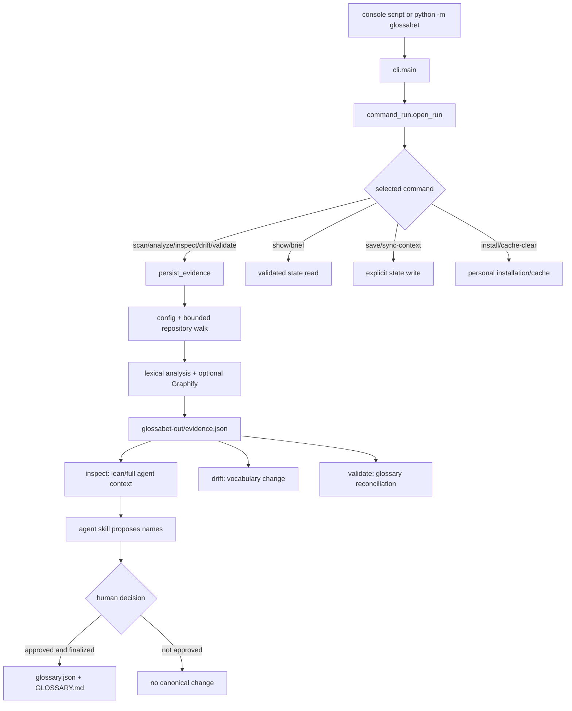

# Maintainer code walkthrough

This document explains the current implementation in execution order. It is
an index into the code, not a substitute for reading it. The executable
[`WALKTHROUGH.md`](WALKTHROUGH.md) serves a different audience: it lets a user
exercise the product without learning its internals.

Three kinds of rule recur below:

- A **product rule** says what Glossabet promises, such as “the human decides
  which names become canonical.”
- An **implementation choice** is the current way the code realizes a rule,
  such as plain `TypedDict` documents and feature-oriented packages.
- A **security requirement** protects the hostile-repository boundary, such as
  never importing scanned code or following a direct artifact symlink.

## 1. How to use this walkthrough

### Five-minute orientation

Read [System in one page](#2-system-in-one-page), then
[Startup and dispatch](#4-startup-and-dispatch), and finish with
[Scan and evidence pipeline](#6-scan-and-evidence-pipeline). Those sections
answer what invokes Glossabet, where command control goes, and how a repository
becomes evidence.

### Thirty-minute architecture path

After the five-minute path, read:

1. [Core data documents](#5-core-data-documents) for ownership and
   compatibility;
2. [Graphify path](#7-graphify-path) for optional structural evidence;
3. [Glossary lifecycle](#8-glossary-lifecycle) for drift and validation;
4. [Agent-facing flows](#9-agent-facing-flows) for the deterministic/agent
   boundary; and
5. [Security and failure behavior](#10-security-and-failure-behavior) for
   reads, writes, bounds, and concurrency.

### Deep-dive path

Follow [Suggested source reading order](#12-suggested-source-reading-order),
running the relevant focused tests beside each source file. Use
[How to change Glossabet safely](#11-how-to-change-glossabet-safely) before
editing a public command, persisted document, threshold, finding, or adapter.

## 2. System in one page

Glossabet is two cooperating products:

- The **deterministic engine** is the `glossabet` Python package. It inventories
  static repository text, extracts bounded lexical and optional structural
  evidence, validates persisted state, and writes deterministic artifacts.
- The **agent skill** is [`skill/SKILL.md`](../skill/SKILL.md). It reads a fresh
  bounded projection, selects important code to inspect, and opens a naming
  conversation. Its proposals are not canonical state.

The product rule is that a human explicitly decides which vocabulary becomes
canonical. The skill enforces that rule as an instruction. The engine's `save`
command validates the submitted JSON, but cannot authenticate that a human
approved the preceding conversation.

The main inputs are repository paths and text, optional root
`glossabet.json` configuration, optional
`graphify-out/graph.json` structure, and human-governed
`glossabet-out/glossary.json` state. The principal outputs are repository
evidence, drift and validation reports, bounded agent context, and a canonical
vocabulary brief.

The machine never promotes a proposal by itself, and drift or validation never
renames code. They produce evidence for a maintainer, not verdicts.

## 3. Repository and package map

### Repository map

This table is a navigation aid. The canonical-versus-generated ownership and
distribution lifecycles are defined in the root
[`ARCHITECTURE.md`](../ARCHITECTURE.md#repository-authority-map).

| Path | Purpose |
| --- | --- |
| [`.github/`](../.github/) | Continuous-integration and prepared release workflows. |
| [`docs/`](./) | User walkthrough, performance notes, this maintainer guide, and explicitly historical records. |
| [`evaluation/`](../evaluation/) | Deterministic, agent, Claude, and reviewer evaluation inputs, runners, schemas, and producer-owned evidence; its [`README.md`](../evaluation/README.md) is the file authority map. |
| [`examples/`](../examples/) | The reproducible payment-service sample and its settled glossary. |
| [`glossabet/`](../glossabet/) | Production Python package. |
| [`plugins/`](../plugins/) | Checked-in Codex plugin configuration plus the generated canonical-skill copy, digest-bound runner, and bundled wheel. |
| [`scripts/`](../scripts/) | Development, benchmark, distribution, plugin-build, smoke, and workflow checks. |
| [`skill/`](../skill/) | Canonical agent workflow packaged into the wheel and plugins. |
| [`tests/`](../tests/) | Unit, integration, security-ratchet, compatibility, distribution, and evaluation tests. |
| Root Markdown and `pyproject.toml` | Product, architecture, security, release, privacy, and package contracts. |

### Production package map

| Package/module | Responsibility |
| --- | --- |
| [`glossabet.cli`](../glossabet/cli.py) | Parser construction, lazy dispatch, terminal-safe process boundary, and exit statuses. |
| [`glossabet.command_run`](../glossabet/command_run.py) | Resolve one repository root and apply a command's no/optional/required glossary policy. |
| [`glossabet.runtime`](../glossabet/runtime/) | Artifact paths and atomic I/O, coverage ledgers, terminal escaping, executable lookup, and hardened Git state. |
| [`glossabet.corpus`](../glossabet/corpus/) | Configuration, path policy, bounded traversal, extraction, tokenization, approximate imports, and cache reuse. |
| [`glossabet.analysis`](../glossabet/analysis/) | Evidence schema and assembly, vocabulary, terminology, importance, and Graphify adaptation. |
| [`glossabet.glossary`](../glossabet/glossary/) | Glossary schema/storage, scopes, matching, findings, drift, bindings, and structural reconciliation. |
| [`glossabet.agent`](../glossabet/agent/) | Lean/full context, bounded brief, managed-block inspection, and explicit synchronization. |
| [`glossabet.install`](../glossabet/install/) | Canonical skill installation and Claude skills-directory plugin files. |
| [`glossabet.managed_block`](../glossabet/managed_block.py) | Dependency-free block markers shared by corpus stripping and agent context management. |

The important dependency choices are deliberately few:

| Dependency | Why it exists |
| --- | --- |
| Python standard library | The installed engine has zero third-party runtime dependencies. |
| `git` executable | One hardened subprocess supplies HEAD, dirty state, and one path's Git state. No shell is involved. |
| Graphify JSON | Optional external evidence enters only through a bounded tolerant adapter; Graphify is not imported or executed. |
| PyYAML 6.0.3 | Development-only parsing for workflow policy checks. Reimplementing general YAML parsing would be a correctness and security liability. |
| actionlint 1.7.12 | Development/CI-only upstream GitHub Actions syntax, expression, input, and injection checking. |
| pytest, Ruff, mypy, Hatchling | Test, static-check, and build tools; none appears in wheel runtime metadata. |

Selected fully-qualified import rules in
[`tests/test_module_dependencies.py`](../tests/test_module_dependencies.py)
protect the boundaries that would otherwise be easy to erode: runtime cannot
depend on domain features, the glossary model remains a leaf, Graphify input
does not depend on group construction, and finding producers do not import the
reconciliation orchestrator.

### Evaluation lane map

The four executable evaluator files are deliberately thin wrappers. Their
implementations live in lane packages under [`evaluation/`](../evaluation/),
whose own [`README.md`](../evaluation/README.md) is the detailed input/code/
evidence authority map.

| Lane | Main owners | Where a maintainer changes it |
| --- | --- | --- |
| Deterministic | `evaluation/deterministic/` behind `evaluation/run.py` | Add a labelled case or threshold in `corpus.json`; add source handling in `sources.py`; keep each scoring rule with its family in `scoring.py`; aggregate and verify in `results.py`. |
| Installed Codex | `evaluation/codex/` behind `scripts/agent_eval.py` | Add a case to `agent-scenarios.json`, build its repository in `fixtures.py`, judge it in `scenarios.py`, and keep process/plugin lifecycle in `host.py`/`runner.py`. |
| Claude Code | `evaluation/claude/` behind `scripts/claude_eval.py` | Add a case to `claude-scenarios.json`, then update `fixtures.py` and `scenarios.py`; authentication/profile handling stays in `host.py`, orchestration in `runner.py`. |
| Blinded reviewer | `evaluation/reviewer/` behind `evaluation/review.py` | Change blinded input construction in `packet.py`, packet-only trace rules in `trace.py`, live Codex execution in `host.py`, and judgment comparison or verification in `results.py`. |

Live execution and offline evidence checking are separate responsibilities.
Codex, Claude, and reviewer `results.py` modules never import their live host;
the reviewer CLI additionally imports `host.py` only inside the
`--run-reviewer` branch. The reviewer lane's only cross-lane dependency is the
deterministic package's public result reader and verifier.

Every verifier distinguishes **genuine** from **current**. Default verification
checks the retained artifact's internal claim without pretending it describes
today's source. `--current` additionally compares current inputs, governing
code identity, artifacts, and release gates. The aggregate identity in
[`evaluation.harness.identity`](../evaluation/harness/identity.py) hashes the
entry wrapper, every Python file in that lane, and the harness modules the lane
imports, so moving logic behind a wrapper cannot hide evaluator changes.

Codex and Claude raw runs are immutable and their histories append attempts;
misses remain evidence. The reviewer retains each accepted blinded packet by
content digest before committing its result. Do not edit evidence to make a
check pass: change the maintained scenario, score, or rule at its owner, run
the authorized producer, and retain the old live-attempt history.

## 4. Startup and dispatch

[`pyproject.toml`](../pyproject.toml) registers the console entry point as
`glossabet = "glossabet.cli:main"`. Running the package through
[`glossabet.__main__`](../glossabet/__main__.py) reaches the same `cli.main`
function and raises `SystemExit` with its result.

[`cli.build_parser`](../glossabet/cli.py) owns the public command surface.
Its private `_Parser.error` remaps argparse usage failures from status 2 to
status 1 because Glossabet reserves status 2 for an internal defect.
[`cli._run`](../glossabet/cli.py) parses into `_Arguments` and imports only the
selected command implementation. Those lazy imports keep help/version startup
small and prevent unrelated feature initialization from affecting another
command.

`cli.main` wraps the whole call in
[`safe_terminal_streams`](../glossabet/runtime/display.py). `cli._main` then
owns flushing, closed-pipe behavior, operating-system errors, expected
`ArtifactError` failures, and unexpected exceptions. Repository-controlled
terminal controls and bidirectional formatting are rendered visibly even in a
traceback.

| Status | Meaning |
| ---: | --- |
| 0 | The selected command completed successfully. |
| 1 | Usage, input, artifact, filesystem, or output-stream error attributable to the invocation/environment. |
| 2 | Unexpected exception: an internal Glossabet defect. |

Repository commands normally begin at
[`command_run.open_run`](../glossabet/command_run.py). It:

1. stats and resolves the requested root;
2. rejects a non-directory and a proven Glossabet output subtree—an exact
   regular current artifact proves an exact lowercase `glossabet-out/`
   component, while a differently cased preserved spelling additionally needs
   matching non-symlink directory identity; spelling alone, a lowercase
   symlink, or a directory/special entry with an artifact-shaped name does not;
3. applies `GLOSSARY_NONE`, `GLOSSARY_OPTIONAL`, or `GLOSSARY_REQUIRED`; and
4. turns malformed or missing-required glossary state into one `RunError`
   policy rather than duplicating it in each command.

The resulting frozen `Run` contains the resolved `root` and optional validated
`glossary`. `Run.required_glossary` makes a required-policy assumption explicit
at the use site.

## 5. Core data documents

All JSON contracts remain plain dictionaries. `TypedDict` gives static field
checking without adding a runtime serialization object or a parallel view of
the document.

| Document | Producer and consumers | Location and schema owner | Compatibility and coverage |
| --- | --- | --- | --- |
| Configuration evidence | [`corpus.config.load_config`](../glossabet/corpus/config.py) produces a `RepositoryConfig`; the scanner consumes its rules and `build_evidence` embeds `as_evidence()`. | Optional root `glossabet.json`, schema 1; [`corpus.config`](../glossabet/corpus/config.py) owns both accepted input and the embedded `ConfigurationEvidence` shape. | Absence is explicit and valid. Other versions, unknown fields, malformed paths, duplicate role ownership, or unsafe files fail closed. The embedded record repeats every effective user rule and the accepted shape; path omissions appear in repository coverage. |
| Repository evidence | [`analysis.evidence.build_evidence`](../glossabet/analysis/evidence.py) assembles it; `persist_evidence` refreshes and writes it for scan/analyze/inspect/drift/validate. Reports, agent context, matching, drift, and reconciliation consume it. | `glossabet-out/evidence.json`, schema 17; [`analysis.evidence_types`](../glossabet/analysis/evidence_types.py) owns field types and [`analysis.evidence`](../glossabet/analysis/evidence.py) owns assembly. | Normal consumers use freshly rebuilt evidence, not a legacy artifact loader. [`evidence_facts`](../glossabet/analysis/evidence_facts.py) is the narrow tolerant boundary for older or hand-built omission data and defaults missing completeness proof to incomplete. `skipped.corpus_budget` and per-collection `CoverageLedger` records separate known drops from unknown upstream omissions. |
| Glossary document | The skill submits a human-settled document to `save`; [`glossary.store.save_glossary`](../glossabet/glossary/store.py) validates, normalizes, and writes it. Every maintained-vocabulary path consumes it. | `glossabet-out/glossary.json`, schema 1; [`glossary.model`](../glossabet/glossary/model.py) owns meaning, [`glossary.schema`](../glossabet/glossary/schema.py) validation, and [`glossary.store`](../glossabet/glossary/store.py) persistence/hash. | Only schema 1 is accepted; unknown fields and ambiguous ownership are rejected rather than migrated silently. Semantic ceilings reject an over-large state. This is human-governed state, so it has no “partial glossary” coverage mode. |
| Drift document | [`glossary.drift.build_drift`](../glossabet/glossary/drift.py) produces it from fresh evidence and a glossary; `drift_command` persists and renders it. Maintainers and the skill consume it. | `glossabet-out/drift.json`, schema 7; [`glossary.drift`](../glossabet/glossary/drift.py) owns its sections while [`glossary.findings`](../glossabet/glossary/findings.py) owns shared finding/coverage shapes. | Rebuilt rather than migrated. Each section carries exact/lower-bound totals, drops, and reasons; top-level completeness is true only when all relevant section totals are exact. |
| Validation document | [`glossary.reconcile.build_validation`](../glossabet/glossary/reconcile.py) combines drift, bindings, structure, managed context, and root-glossary metadata; `validate_command` persists and renders it. | `glossabet-out/validation.json`, schema 12; [`glossary.reconcile`](../glossabet/glossary/reconcile.py) owns composition and [`glossary.findings`](../glossabet/glossary/findings.py) owns common shapes. | Rebuilt rather than migrated. `finding_checks` names every skipped finding-producing check; `total_findings_exact` describes only the total from checks that ran. The `graph` object is the sole graph state and always carries presence, usability, freshness, warnings, and group coverage. Overloaded-region detail separates `concept_count`/`concept_count_exact` from a deterministic ten-ID `concepts_sample` and its own truncation flag. |
| Agent context | [`agent.agent_context.build_agent_context`](../glossabet/agent/agent_context.py) projects fresh evidence and optional glossary metadata; `inspect_command` serializes it to stdout for the skill. | Not persisted by `inspect`; context schema 6 declares evidence schema 17 alongside it. [`agent.agent_context_protocol`](../glossabet/agent/agent_context_protocol.py) owns the versioned shapes; [`agent.agent_context`](../glossabet/agent/agent_context.py) owns projection and serialization. | The skill refuses an unexpected context version. Lean and full projections share one schema but deliberately retain different detail. `coverage.corpus` retains detailed scanner-budget evidence. `coverage.context` names the selected projection and actual limits, then separates source completeness, projection completeness, intentional exclusions, source omissions, and limit-driven truncations. |
| Managed context | [`agent.managed_context.render_block`](../glossabet/agent/managed_context.py) derives one block from the glossary; [`agent.context_sync.sync_context`](../glossabet/agent/context_sync.py) is the explicit writer. Agent hosts consume the block; drift and validation inspect it. | One marked range in root `AGENTS.md` or `CLAUDE.md`. [`managed_block`](../glossabet/managed_block.py) owns wire format 1; [`agent.managed_context`](../glossabet/agent/managed_context.py) owns report schema 1. | Exact content and semantic glossary hashes distinguish current, stale, edited, absent, and uninspectable. An older format is stale; a newer or changed block is edited and is never replaced without an unambiguous range plus explicit `--force`. The embedded brief carries its own byte/entry coverage, while the report names every target issue. |

The shared [`CoverageLedger`](../glossabet/runtime/coverage.py) is the key
completeness contract:

- `total_items` is the number currently known;
- `included_items` is the retained detail;
- `dropped_items` is the known difference;
- `total_items_exact` says whether upstream work covered all accepted input;
- `complete` requires an exact total, no dropped detail, and no limitation
  reason.

An unknown number of omitted findings is therefore never invented as a
numeric dropped count.

## 6. Scan and evidence pipeline

The evidence path is one composition, not several competing scanners:

1. [`persist_evidence`](../glossabet/analysis/evidence.py) calls
   `build_evidence(cache=True)`.
2. [`load_config`](../glossabet/corpus/config.py) performs a bounded,
   confined read of optional `glossabet.json`.
3. [`walk_repository`](../glossabet/corpus/scanner.py) creates a deterministic
   inventory and one `CorpusBudget`.
4. [`SourceExtractor`](../glossabet/corpus/extraction.py) reads admitted files,
   reuses digest-matching cache entries, and reclassifies read failures into
   the same budget.
5. `build_evidence` folds production code and documentation, builds analyses,
   assembles the typed document, saves the user cache, and atomically writes
   `evidence.json`.

### Discovery, traversal, roles, and exclusions

`RepositoryConfig.role_for` recognizes `production`, `test`, `fixture`,
`generated`, and `vendored`. Built-in conventions provide conservative
defaults; literal configured prefixes can override roles, the most-specific
configured prefix wins, and configured ignores win over roles. Test and
fixture files stay in inventory but do not drive production vocabulary unless
explicitly reclassified. Generated and vendored paths are pruned and reported.

The scanner uses bounded `os.scandir` snapshots sorted by entry name. A
directory that exceeds the per-directory ceiling is skipped as a whole;
keeping an arbitrary filesystem-order prefix would make results
nondeterministic. It never descends directory symlinks. A file symlink is read
only if its resolved content remains inside the root and is not sensitive,
hidden, configured out, generated, vendored, or Glossabet-owned.

Security exclusions take priority over configurable classification. Dotenv
variants, common key/credential paths, Glossabet and Graphify output
directories, `GLOSSARY.md`, `GLOSSABET.md`, and managed Glossabet blocks are
kept out of lexical evidence. Each exclusion family has one stable entry in
[`EXCLUSION_KINDS`](../glossabet/corpus/walk_budget.py), which pins its artifact
key, collection, and user-facing sentence together.

### Work budgets and omission ledgers

[`CorpusBudget`](../glossabet/corpus/walk_budget.py) owns the entry, directory,
file-count, file-byte, aggregate-source-byte, and per-file ceilings. It records
used work, skipped accepted sources, whether skipped sources were production,
and an honestly qualified walk remainder. A file admitted during traversal but
unreadable during extraction is moved from “used” to “skipped”; it is never
counted on both sides or silently lost.

Downstream vocabulary, terminology, naming, matching, findings, structural
groups, context, and brief limits use the same principle: keep a deterministic
prefix or sample and serialize what was omitted and why.

### Extraction, cache, and analysis

[`read_source`](../glossabet/corpus/extraction.py) reads bytes and accepts only
UTF-8 text (a leading byte-order mark is ignored). Binary, non-UTF-8, and
unreadable files become explicit omissions. Code is lexically tokenized; it is
never imported, parsed into executable objects, or run.

The user cache in [`corpus.cache`](../glossabet/corpus/cache.py) is disposable
and outside the repository. An entry is reused only when its kind and current
content SHA-256 match. Cache hits and cold extraction feed the same fold, so
the resulting artifact bytes stay identical.

The fold produces:

- [`ProductionVocabulary`](../glossabet/analysis/vocabulary.py) and
  `DocumentationVocabulary`;
- regex-level, explicitly `lossy` imports through
  [`build_imports_section`](../glossabet/corpus/imports.py);
- terminology register, code/document layers, suspected synonyms, context
  dispersion, and overload signals through
  [`build_terminology`](../glossabet/analysis/terminology.py);
- import- and vocabulary-derived naming importance through
  [`build_naming_candidates`](../glossabet/analysis/importance.py); and
- optional structural groups and nominations through the Graphify facade.

`scan` persists evidence and prints an inventory/naming summary. `analyze`
runs the same path and additionally renders terminology analysis. `inspect`,
`drift`, and `validate` also refresh this same evidence before consuming it.

## 7. Graphify path

Graphify is an optional evidence source, not an installed runtime dependency.
[`analysis.graphify`](../glossabet/analysis/graphify.py) is the stable facade
over two owners.

### Bounded input and normalization

[`load_graph_input`](../glossabet/analysis/graphify_input.py) confines and
boundedly reads `graphify-out/graph.json`. Before materializing normalized
relationships it counts nodes, edges, communities, and member references
against `GRAPH_WORK_BUDGET`. It then:

- accepts only recognizable non-empty node shapes;
- truncates individual labels and bounds aggregate label-tokenization work;
- normalizes alternate field spellings through `first_value`;
- builds a valid-edge degree summary; and
- classifies freshness from `built_at_commit` and the hardened repository Git
  stamp.

The frozen `GraphInput` is the complete seam: presence, normalized `GraphNode`
mapping, communities, degrees, edge count, discounted node ids, freshness, and
warnings. Group construction never rereads the hostile JSON.

### Provenance discounting and groups

Node provenance is classified as code, documentation, or glossary-derived.
Nodes sourced from `GLOSSARY.md`, `GLOSSABET.md`, a Glossabet output directory,
or an explicit glossary type are counted but discounted from edges, visible
members, god nodes, tokens, and nominations. Otherwise settled vocabulary
could echo back as fake structural confirmation.

[`build_structural_groups`](../glossabet/analysis/graphify_groups.py) prefers an
explicit community list and falls back to per-node community attributes. It
deduplicates members, resolves conflicting labels deterministically, memoizes
tokenization, and emits capped:

- groups with member samples, a capped and explicitly covered set of matchable
  member tokens, cohesion, and provenance counts;
- high-degree “god node” summaries; and
- structure naming candidates.

Group, god-node, member-sample, member-token, label, and nomination caps each
carry coverage. Missing, malformed, symlinked, oversized, unsupported, or
over-budget input produces visible warnings and lexical-only fallback rather
than failing the whole scan. A stale or unverified graph remains explicitly
labelled by its freshness record instead of masquerading as current.
`--no-graphify` records an explicitly disabled adapter instead of pretending
the file was absent. Every emitted state has explicit `present`, `usable`,
`freshness`, and `warnings` fields; optional normalized details exist only when
their source was loaded.

## 8. Glossary lifecycle

### Schema, validation, persistence, and hashing

[`glossary.model`](../glossabet/glossary/model.py) defines concepts, statuses,
aliases, stable bindings (`symbol`, `file`, `module`), and optional literal
path-prefix scopes. [`validate_glossary`](../glossabet/glossary/schema.py)
checks the entire untrusted object before
[`checked_glossary`](../glossabet/glossary/schema.py) narrows it to
`GlossaryDocument`. It rejects unknown fields, invalid strings, ambiguous
overlapping vocabulary ownership, unstable binding kinds, and semantic work
above its limits. Scope prefixes are canonicalized to NFC before duplicate,
ancestry, and ownership checks, while canonically distinct paths remain
distinct.

[`load_glossary`](../glossabet/glossary/store.py) returns scope paths in NFC.
[`save_glossary`](../glossabet/glossary/store.py) writes that form and sorts
scopes and concepts, then uses shared confined atomic artifact I/O. This stays
glossary schema 1: path membership already gave canonically equivalent Unicode
spellings one meaning, and existing schema-1 files are accepted and normalized
in memory rather than requiring a migration.
The `save` command carries the stdin-read outcome separately from the parsed
value, so JSON `null` reaches this schema validator and reports “top level must
be an object”; only an actual read, size, or parse failure uses an input
diagnostic.
[`glossary_sha256`](../glossabet/glossary/store.py) hashes canonical
sort-key JSON, so semantically identical state has one digest independent of
pretty-print layout.

These modules also define an import-ownership boundary. Internal callers take
schema types and constants from [`glossary.model`](../glossabet/glossary/model.py),
validation from [`glossary.schema`](../glossabet/glossary/schema.py), scope
behavior from [`glossary.scope`](../glossabet/glossary/scope.py), and only
persistence behavior from [`glossary.store`](../glossabet/glossary/store.py).
The store still exposes its exact pre-split aliases for Python import
compatibility, but new internal code does not use those aliases as an ownership
shortcut.

### Existing root glossary

A maintainer-owned root `GLOSSARY.md` is separate from Glossabet's structured
state. [`repository_glossary_section`](../glossabet/glossary/repository_glossary.py)
discovers the exact root name, performs a bounded safe read, records size and
SHA-256, and optionally runs a bounded lexical divergence check against the
structured glossary. It sends metadata, not Markdown content, into agent
context. Nested `GLOSSARY.md` files are reported as ignored.

The skill first forms an independent model without reading the root Markdown's
content, then may deliberately read and surgically reconcile a safe existing
root document. The engine never regenerates that Markdown document wholesale.

### Matching, drift, and validation

[`EvidenceIndex`](../glossabet/glossary/matching.py) is the shared bounded
lexical index. A one-word term matches token evidence. A compound matches only
an ordered contiguous token run inside one identifier, not unrelated word hits
in a file. Scope filtering and compound-start work each retain completeness
ledgers.

Every numeric occurrence fact says whether its value is exact through
`count_exact`, `files_exact`, or `modules_exact`. The separate
`locations_truncated` flag describes only the location list shown to a
consumer. Upstream location clipping can therefore make a scoped total a lower
bound, while sampling five locations after all totals are computed leaves those
totals exact. Identifier evidence persists its exact module total from every
accepted scanned file instead of reconstructing it from a location sample.

Analytical producers use [`is_unproven_zero`](../glossabet/glossary/matching.py)
when table truncation, a scoped location sample, partial corpus coverage,
matching work, or a term limit makes zero only a lower bound. Such a zero
cannot establish absence. Threshold checks follow the same one-sided rule for
simple and compound terms: a lower bound already at the threshold proves the
positive finding and is labelled “at least”; an inexact lower bound below the
threshold cannot prove the negative, so the finding is suppressed and the
section records why its total is incomplete.

[`build_drift`](../glossabet/glossary/drift.py) asks how already governed
vocabulary is changing:

- does a new term parallel a canonical term?
- is a watched alias still used?
- is a canonical term fading?
- does a canonical term appear in disjoint contexts?

[`build_validation`](../glossabet/glossary/reconcile.py) asks whether the
glossary still reconciles with the repository. It combines:

- [`BindingFindings`](../glossabet/glossary/binding_validation.py) for orphaned
  concepts, unresolved/uncertain bindings, and fragmentation;
- [`StructuralValidation`](../glossabet/glossary/structural_validation.py) for
  unnamed groups, boundary mismatch, and overloaded structural regions;
- selected drift sections; and
- managed-context and root-glossary reports.

Its eight finding-producing checks have a separate `finding_checks` execution
record. `all_executed` is false and `skipped` names reasons when optional
structure or path scope prevents a check from running. Independently,
`total_findings_exact` says whether the numeric total from checks that did run
is exact. The graph object is authoritative; no parallel availability flag is
serialized.

Drift is about change in vocabulary use. Validation is the broader consistency
check between canonical concepts, code bindings, lexical evidence, optional
structure, and maintained documents.

[`glossary.findings`](../glossabet/glossary/findings.py) keeps epistemic labels
literal. `observed_finding` records a directly evidenced fact with
`certainty`. `heuristic_finding` records a calibrated nomination with
`signal_strength`, which is not a probability. Both are capped and rendered
through the same section/coverage contract. Neither auto-fixes anything.

## 9. Agent-facing flows

### `inspect`

[`agent_context_protocol`](../glossabet/agent/agent_context_protocol.py) owns
the version and static document shapes without importing projection or command
behavior. [`inspect_command`](../glossabet/agent/agent_context.py) opens an
optional glossary, refreshes and persists evidence, safely discovers
root-glossary metadata, builds that context, and prints deterministic compact
JSON.

The normal lean projection rolls repeated file locations up to modules, adds
useful naming-candidate locations and identifier-style exemplars, and omits
the raw approximate import section. Exact token and identifier `modules`
scalars survive that projection; `module_counts_truncated` applies only to the
detailed rollup. `inspect --full` retains detailed vocabulary locations for
diagnosis. Both bound list and string sizes, enforce a hard serialized-byte
limit, and report the limits actually applied. Their context ledger keeps
designed protocol exclusions separate from unavailable source evidence and
limit-driven truncations; only the last category makes the selected projection
incomplete.

### `brief`

[`brief_command`](../glossabet/agent/brief.py) is the read-only ambient path.
It does not scan and does not write the repository. With no glossary it emits
nothing. Otherwise it reads the validated glossary and hardened Git state,
then emits at most 4 KiB of canonical vocabulary with origin, semantic digest,
entry truncation, and coverage. `build_managed_brief` produces the stable
variant used in a persisted block without pretending a stored file contains
live Git state.

### Managed context

[`render_block`](../glossabet/agent/managed_context.py) wraps the managed brief
in exact start/end markers plus format, glossary, and content hashes.
`analyze_managed_block` classifies the range without writing.
`inspect_managed_context` checks both supported root host files; drift and
validation include its report.

[`sync_context`](../glossabet/agent/context_sync.py) is the only engine feature
that writes a host instruction file. It targets exactly root `AGENTS.md` or
`CLAUDE.md`, preserves surrounding bytes/newline style/mode, refuses symlinks
and ambiguous markers, requires a confirmed exact directory-entry name and
available portable identity for an existing target, rechecks bytes and mode
immediately before atomic replacement, and requires `--force` for an edited
but structurally bounded block. A different spelling, an indeterminate bounded
exact-name lookup, or unavailable identity is reported as uninspectable and
leaves the target unchanged. If the reader first observes a target and the
exact-name check then observes absence or a restored exact entry, it reports a
concurrent change instead of misdiagnosing a stable alternate spelling.

[`strip_managed_context_for_evidence`](../glossabet/managed_block.py) removes
one unambiguous marked range before host instructions become documentation
evidence. Hand-written surrounding instructions remain evidence. This prevents
canonical vocabulary from becoming evidence for itself.

### Skill and plugin packaging

[`skill/SKILL.md`](../skill/SKILL.md) is canonical:

- the wheel force-includes it as `glossabet/_skill/SKILL.md`;
- [`canonical_skill_text`](../glossabet/install/installer.py) loads that
  packaged resource (or the source copy during development);
- `install_skill` writes it idempotently to a default personal or explicit
  destination, rejecting symlink components and differing existing content;
- `install_claude_plugin` may add a manifest and `SessionStart` hook in the
  same Claude skill folder, naming a version-verified installed executable;
  and
- [`scripts/build_plugin.py`](../scripts/build_plugin.py) copies the same skill
  and one verified wheel into the checked-in Codex plugin.

The Codex plugin's
[`run_glossabet.py`](../plugins/glossabet/skills/glossabet/scripts/run_glossabet.py)
checks manifest version, the sole wheel filename, and the pinned wheel SHA-256
before placing that wheel after the standard library but before installed
site-packages. Its isolated hook runs `brief .`. The Claude hook also runs the
installed `brief .` boundary. Neither hook scans or writes a target repository.

## 10. Security and failure behavior

### Hostile input and enforced bounds

The selected repository may control names and contents, configuration,
Graphify JSON, glossary JSON, root host files, Git metadata/configuration, and
pre-created output paths. The engine responds with:

- root confinement and no-symlink direct artifact paths;
- byte-bounded reads based on bytes actually read;
- deterministic walk and aggregate-work ceilings;
- strict config/glossary validation and tolerant Graphify fallback;
- content-digest cache validation;
- terminal escaping;
- same-directory temporary files, flush/fsync, and atomic replacement; and
- explicit coverage whenever any accepted input or output detail is omitted.

Repository code is read as text and never imported or executed. Production
analysis makes no network requests and invokes no shell. The only analysis
subprocess is an absolute-path `git` command with repository execution-capable
configuration disabled, no prompt, an argument vector, and a timeout.

Development and release tools have a different boundary: dependency
installation, live evaluation modes, plugin-host smoke tests, corpus fetching,
and release publication may use a network when explicitly invoked.

### Write inventory

| Operation | Repository effects |
| --- | --- |
| `scan` / `analyze` | Refresh `glossabet-out/evidence.json`. |
| `inspect` | Refresh `glossabet-out/evidence.json`, then print agent context; the context itself is not persisted. |
| `drift` | Refresh `glossabet-out/evidence.json` and write `glossabet-out/drift.json`. |
| `validate` | Refresh `glossabet-out/evidence.json` and write `glossabet-out/validation.json`. |
| `save` | Validate stdin and write human-governed `glossabet-out/glossary.json`. |
| `sync-context` | Explicitly create or update one managed range in root `AGENTS.md` or `CLAUDE.md`. |
| `show` / `brief` | No repository write. |
| `cache-clear` | No repository write; removes a fully recognized Glossabet cache and leaves mixed or unreadable roots untouched. |
| `install` | No analyzed-repository write by default; writes the reported personal or explicit skill destination. |
| Agent finalization | The skill may edit/create root `GLOSSARY.md`, refresh root `GLOSSABET.md`, and pipe approved structured state through `save`. These are agent actions under human direction, not automatic scan behavior. |

Evidence-building commands may also update the disposable extraction cache
outside the repository.

### Failure and concurrency boundary

Unsafe configuration or glossary state is a user error. Optional Graphify
failure is a warning plus lexical-only evidence. A bounded partial result is a
successful result whose coverage says it is partial; the program does not
convert missing proof into a clean finding count.

Artifact writes reject unsafe paths and preserve the previous complete file if
replacement fails. Managed-context writes additionally compare the opened
file's identity and final bytes/mode before replacement. The scanner can
observe ordinary concurrent changes across a non-atomic scan, and selected
surfaces detect those changes, but Glossabet is not defended against an
adversarial process running as the same operating-system user and racing path
components between check and use. [`SECURITY.md`](../SECURITY.md) owns the
complete threat model.

## 11. How to change Glossabet safely

There is no general extension framework. Change the module that already owns
the concept, then prove both the new behavior and the compatibility boundary.

| Change | Owning code | Focused proof | Compatibility questions |
| --- | --- | --- | --- |
| Add a CLI command | Add parser/help in [`cli.build_parser`](../glossabet/cli.py), lazy dispatch in `cli._run`, one feature command function, and [`open_run`](../glossabet/command_run.py) policy if it addresses a repository. | [`tests/test_cli.py`](../tests/test_cli.py), [`tests/test_command_run.py`](../tests/test_command_run.py), plus the owning feature test. | What are its glossary policy, repository/cache writes, stdout contract, and status-1 versus status-2 failures? Does help name them truthfully? |
| Add an evidence field | Declare analysis-owned fields in [`evidence_types`](../glossabet/analysis/evidence_types.py) or reuse the lower-layer type that owns their meaning; produce once in [`evidence`](../glossabet/analysis/evidence.py); project only if the agent needs it. | [`tests/test_evidence.py`](../tests/test_evidence.py), [`tests/test_agent_context.py`](../tests/test_agent_context.py), and affected consumer/evaluation tests. | Is the field deterministic and bounded? What proves completeness? Must `EVIDENCE_SCHEMA_VERSION` or context schema change? How do older/hand-built inputs degrade conservatively? |
| Add a finding kind | Put the producer in [`drift`](../glossabet/glossary/drift.py), [`binding_validation`](../glossabet/glossary/binding_validation.py), or [`structural_validation`](../glossabet/glossary/structural_validation.py); extend [`findings`](../glossabet/glossary/findings.py) only for shared shape/rendering. | [`tests/test_finding_producers.py`](../tests/test_finding_producers.py), [`tests/test_findings.py`](../tests/test_findings.py), and drift/reconciliation end-to-end tests. | Is it observed or heuristic? Which omissions can suppress or weaken it? Are totals exact under every upstream cap? Does a persisted report schema change? |
| Change a threshold policy | Edit the frozen policy in [`analysis.policy`](../glossabet/analysis/policy.py) or [`glossary.policy`](../glossabet/glossary/policy.py), not an unexplained producer literal. | [`tests/test_heuristic_policy.py`](../tests/test_heuristic_policy.py), boundary tests below/at/above the gate, and the relevant labelled evaluation case/results. | What calibration evidence justifies the value? Does it alter only nomination, not document shape? Do recorded deterministic or model evaluations require separately authorized regeneration? |
| Add an evidence adapter | Follow [`graphify_input`](../glossabet/analysis/graphify_input.py) plus [`graphify_groups`](../glossabet/analysis/graphify_groups.py): one bounded normalizer and one downstream analysis owner behind a small facade. | A dedicated adapter test family like [`tests/test_graphify.py`](../tests/test_graphify.py), including malformed, oversized, hostile-shape, determinism, fallback, and work-budget cases. | Who owns the external schema? Can input be absent/unusable without failing lexical analysis? What provenance can echo Glossabet output? Which input and output work must be bounded and reported? |
| Change a persisted schema | Update the owning types/validator/producer, version constant, every consumer, fixtures, distribution/evaluation identity, and migration or explicit rejection behavior together. | Owning round-trip and hostile-input tests, artifact byte/determinism tests, agent context tests when projected, evaluation verifiers, walkthrough, and wheel/plugin smoke when packaged. | Is old state durable human state or replaceable derived output? Must old versions migrate, remain readable, or fail clearly? Are hashes, freshness, generated artifacts, and release notes coupled to the shape? |

After any cross-package change, run
[`tests/test_module_dependencies.py`](../tests/test_module_dependencies.py).
After any new untrusted-input or write path, extend the relevant filesystem,
trust-ratchet, and artifact tests rather than relying on coverage percentage.

## 12. Suggested source reading order

1. [`glossabet/cli.py`](../glossabet/cli.py) — What is the public command and
   process-failure contract?
2. [`glossabet/command_run.py`](../glossabet/command_run.py) — How is a
   repository opened consistently?
3. [`glossabet/corpus/config.py`](../glossabet/corpus/config.py) — How can a
   maintainer adjust path roles without adding executable configuration?
4. [`glossabet/corpus/scanner.py`](../glossabet/corpus/scanner.py) and
   [`walk_budget.py`](../glossabet/corpus/walk_budget.py) — What is admitted,
   excluded, bounded, and reported?
5. [`glossabet/corpus/extraction.py`](../glossabet/corpus/extraction.py) — How
   do bytes become lexical entries or explicit omissions?
6. [`glossabet/analysis/evidence.py`](../glossabet/analysis/evidence.py) and
   [`evidence_types.py`](../glossabet/analysis/evidence_types.py) — How do all
   source facts become one document?
7. [`glossabet/analysis/graphify_input.py`](../glossabet/analysis/graphify_input.py)
   and [`graphify_groups.py`](../glossabet/analysis/graphify_groups.py) — Where
   does optional external structure enter and degrade?
8. [`glossabet/glossary/model.py`](../glossabet/glossary/model.py),
   [`schema.py`](../glossabet/glossary/schema.py), and
   [`store.py`](../glossabet/glossary/store.py) — What makes vocabulary valid,
   scoped, durable, and hashable?
9. [`glossabet/glossary/matching.py`](../glossabet/glossary/matching.py) and
   [`findings.py`](../glossabet/glossary/findings.py) — How are occurrences,
   epistemic status, and incomplete work represented?
10. [`glossabet/glossary/drift.py`](../glossabet/glossary/drift.py) and
    [`reconcile.py`](../glossabet/glossary/reconcile.py) — Why are drift and
    validation different?
11. [`glossabet/agent/agent_context_protocol.py`](../glossabet/agent/agent_context_protocol.py),
    [`agent_context.py`](../glossabet/agent/agent_context.py), and
    [`brief.py`](../glossabet/agent/brief.py) — What crosses from the
    deterministic engine into an agent session, and which module owns its
    shape versus its projection?
12. [`glossabet/agent/managed_context.py`](../glossabet/agent/managed_context.py),
    [`context_sync.py`](../glossabet/agent/context_sync.py), and
    [`glossabet/managed_block.py`](../glossabet/managed_block.py) — How is
    persistent host context inspected, written, and excluded from evidence?
13. [`skill/SKILL.md`](../skill/SKILL.md) — How does the agent turn evidence
    into a human-governed naming conversation?

For quick orientation, the seven common tracing questions land here:

| Question | Answer location |
| --- | --- |
| What invokes Glossabet? | [Startup and dispatch](#4-startup-and-dispatch) |
| How does `scan` become evidence? | [Scan and evidence pipeline](#6-scan-and-evidence-pipeline) |
| How are incomplete results represented? | [Core data documents](#5-core-data-documents) and [Work budgets](#work-budgets-and-omission-ledgers) |
| How does Graphify alter the pipeline? | [Graphify path](#7-graphify-path) |
| How are glossary drift and validation different? | [Matching, drift, and validation](#matching-drift-and-validation) |
| Which operations write repository files? | [Write inventory](#write-inventory) |
| Where would a maintainer add a new analysis? | [How to change Glossabet safely](#11-how-to-change-glossabet-safely) |
